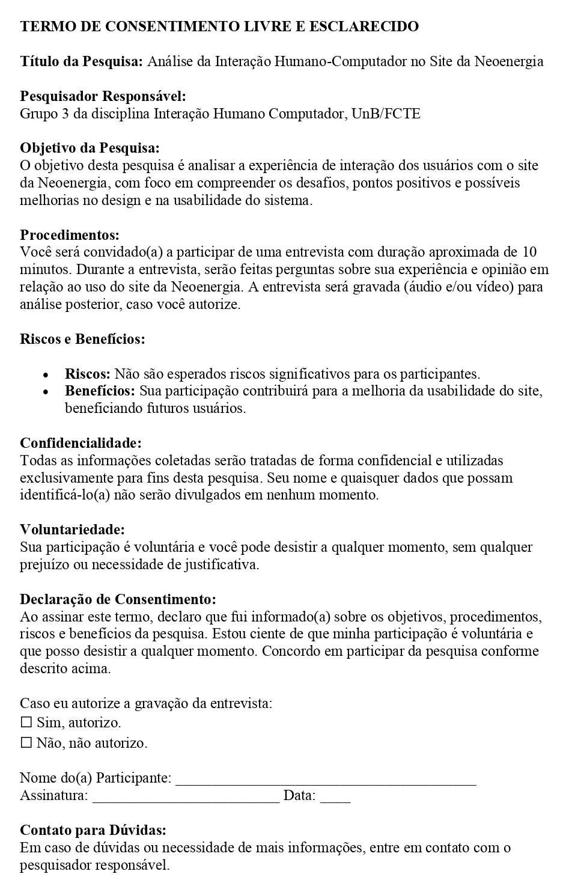

# Aspectos Éticos

## Introdução

De acordo com a Resolução CNS 466/12, toda pesquisa envolvendo seres humanos deve ser submetida à avaliação de um Comitê de Ética em Pesquisa. A norma considera como pesquisa em seres humanos aquelas realizadas em qualquer área do conhecimento e que, de forma direta ou indireta, envolvam indivíduos ou coletividades, seja em sua totalidade ou em partes, incluindo o uso de informações e materiais. Isso inclui entrevistas, aplicação de questionários, utilização de bancos de dados e revisões de prontuários.

Ainda conforme a Resolução 466/12 do Conselho Nacional de Saúde, o respeito à dignidade humana exige que a pesquisa só seja realizada após o consentimento livre e esclarecido dos participantes. No caso de crianças, adolescentes ou pessoas legalmente incapazes, é necessário também o assentimento dos sujeitos, complementado pela autorização de seus representantes legais.

A computação também possui uma preocupação com a ética em suas pesquisas. Associações de profissionais como a ACM e a IEEE, possuem códigos de ética que orientam o trabalho dos seus associados. No código de ética da ACM (1992), podemos destacar os seguintes cuidados éticos: evitar causar danos ou consequências aos outros, tais como perda de informações, perda de bens, danos a propriedades e respeitar a privacidade dos outros e honrar a confidencialidade de informações.

É de responsabiidade da equipe de design proteger o bem-estar físico e psicológico dos participantes de qualquer estudo ou pesquisa realizada. No Brasil, a resolução nº 196/96 do Conselho Nacional de Saúde (1996) regulamenta as pesquisas envolvendo pessoas em qualquer área do conhecimento. Segundo essa resolução, esses cuidados envolvem considerar os seguintes princípios:

* **Príncipio da autonomia:** envolve o consentimento livre e esclarecido dos indivíduos e a proteção a grupos vulneráveis e aos legalmente incapazes. A pesquisa deverá sempre tratá-los com dignidade e respeitá-los em sua autonomia e defendê-los em sua vulnerabilidade.

* **Príncipio da beneficiência:** envolve a ponderação entre riscos e benefícios, tanto atuais como potenciais, individuais ou coletivos, visando o máximo  de benefícios e o mínimo de danos e riscos.

* **Princípio da não maleficência:** envolve a garantia de evitar danos previsíveis relacionados à pesquisa, tanto os imediatos quanto os tardios.

* **Princípio da justiça e equidade:** relacionado à relevância social da pesquisa, com vantagens para os participantes da pesquisa e minimização do ônus para os participantes vulneráveis, o que garante a igual consideração dos interesses envolvidos, não perdendo o sentido de sua destinação sócio-humanitária.

## Termo de Consentimento

Para a realização da pesquisa com o usuário, foi elaborado um termo de consentimento para garantir que os aspectos éticos sejam cumpridos. O termo pode ser conferido na figura 1 a seguir:

**Figura 1** - Termo de Consentimento

{ width="600px" }

_Fonte: Henrique Alencar_

## Bibliografia

> 1. UNESP. Ética em Pesquisa com Seres Humanos. Disponível em: <a href="https://www.rosana.unesp.br/#!/pesquisa/orientacoes-e-manual/etica-em-pesquisa-com-seres-humanos/" target="_blank">https://www.rosana.unesp.br/#!/pesquisa/orientacoes-e-manual/etica-em-pesquisa-com-seres-humanos/</a>

> 2. BARBOSA, Simone; DINIZ, Bruno. Interação Humano-Computador. Editora Elsevier, Rio de Janeiro, 2010.

## Histórico de versão

| Versão | Data       | Descrição                             | Autor(es)                                       | Revisor(es)             |
| ------ | ---------- | ------------------------------------- | ----------------------------------------------- | ----------------------- |
| `1.0`  | 29/11/2024 | Criação da página                     | [Henrique Alencar](https://github.com/henryqma) | Dara Maria, Davi Casseb |
| `1.1`  | 03/12/2024 | Criação da página                     | [Henrique Alencar](https://github.com/henryqma) | Dara Maria, Davi Casseb |