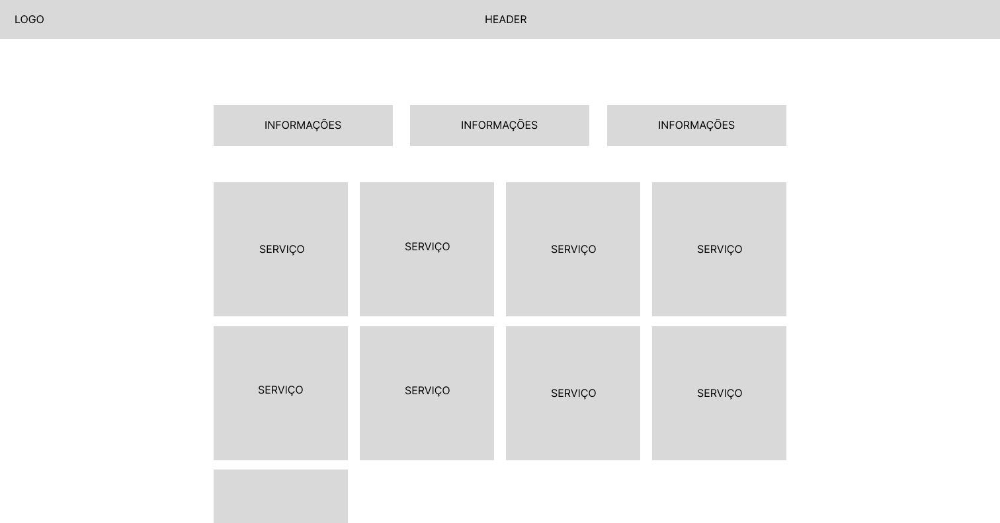
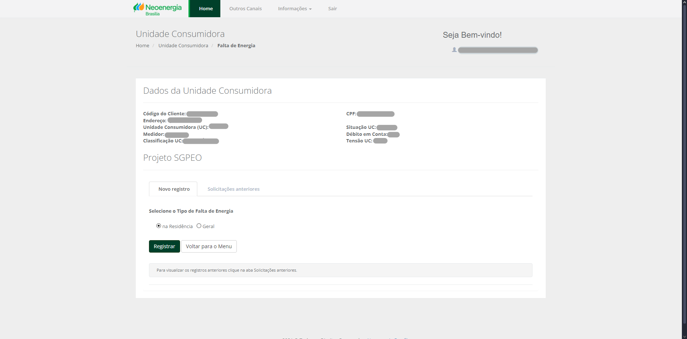
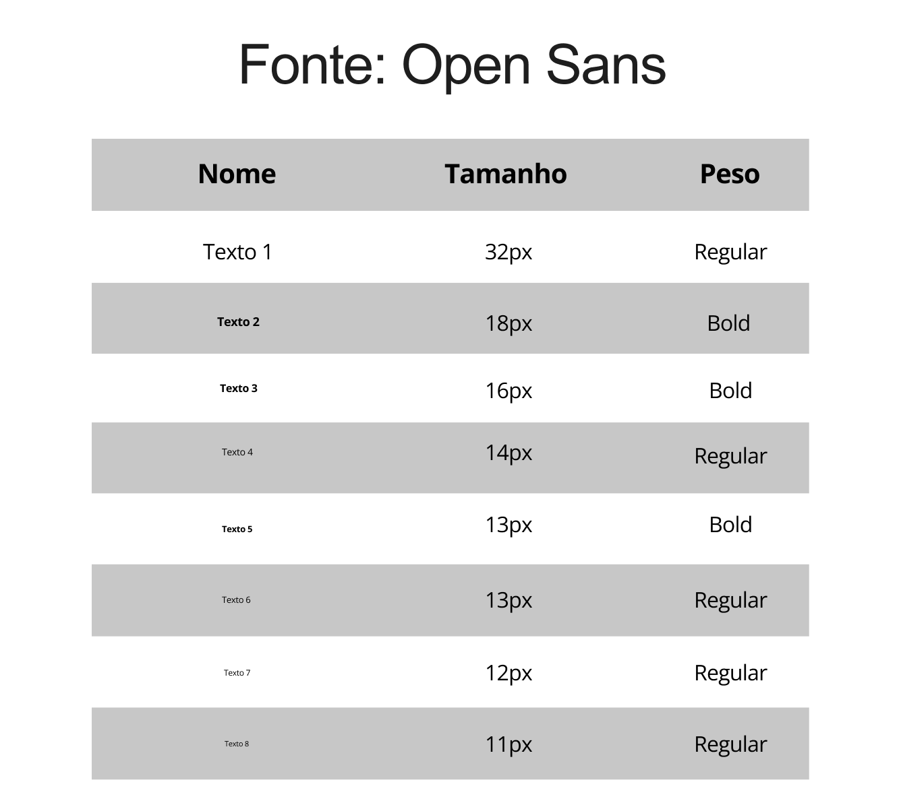
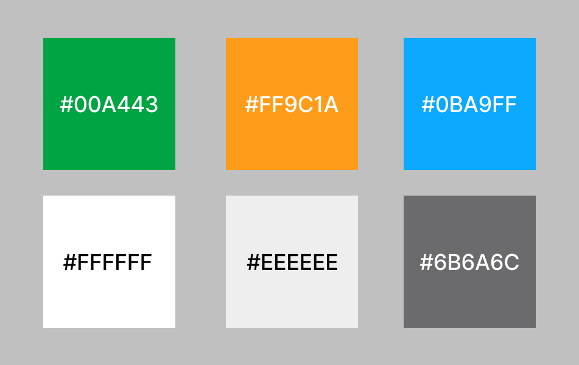

# Guia de Estilo

## Introdução

O guia de estilo reúne os princípios e as diretrizes adotadas em um projeto, fazendo um registro das principais decisões de design tomadas, de forma que elas não se percam, sendo assim efetivamente incorporadas no produto final. Ele também serve como ferramente de comunicação entre os membros da equipe, tendo suma importância que as decisões possam ser consultadas com facilidade e discutidas em projeções futuras.

### Objetivo

Esse guia tem como objetivo analisar o design e as interfaces do site da Agência Virtual da Neoenergia e sua eficácia na utilização dos usuários. Iremos analisar os elementos:

* Elementos de interface: disposição espacial e grid, janelas, tipografia e cores;

* Elementos de interação: estilos de interação, seleção de um estilo e aceleradores (atalhos);

* Elementos de ação: preenchimento de campo, seleção e ativação.

### Organização e Conteúdo

O guia de estilo da Agência Virtual da Neoenergia será divido em tópicos e subtópicos, abordando cada um dos elementos citados acima e suas respectivas características.

### Público-alvo

O público alvo deste guia são os alunos da disciplina de Interação Humano Computador, responsáveis pelo projeto de análise do site da Neoenergia, e eventuais interessados que desejam ter como base as decisões de design e interface abordadas neste documento.

### Como utilizar

O guia pode ser utilizado como referência nas decisões de design durante todo o projeto de Interação Humano Computador, fornecendo assim informações necessárias que garantam as necessidades dos usuários finais, tornando o sistema mais satisfatório e eficiente possível.

### Como manter

É importante que a atualização deste guia seja feita em caso de qualquer decisão tomada pela equipe, assim garantindo que todas as alterações realizadas estejam em conformidade com este documento, mantendo a consistência visual e de interação do sistema, permitindo uma melhor experiência do usuário e evitando possíveis problemas de usabilidade.

## Resultados da Análise

### Descrição do ambiente de trabalho do usuário

A maioria dos usuários acessa o site da Neoenergia por meio de computador, seja ele desktop ou notebook. Então, é de suma importância considerar as especificidades desses dispositivos ao projetar as interfaces do sistema, garantindo uma boa experiência para os usuários, como a adaptação de interfaces para diferentes tamanhos de tela e o uso de elementos visuais apropriados.

## Elementos de interface

### Disposição espacial e GRID

O estilo de layout da Agência Virtual da Neoenergia é feita por botões centralizados que dividem todos os serviços que podem ser feitos no site, além de botões que mostram e permitem editar informações. A figura 1 mostra a disposição desses elementos.

**Figura 1** - Disposição espacial e GRID

{ width="900px" }

_Autor: Henrique Alencar_

### Janelas

O site possui várias janelas, como de escolher a residência, a principal com todos os serviços e uma para cada serviço, que seguem o mesmo padrão. As figuras 2, 3 e 4 mostram essas janelas respectivamente.

**Figura 2** - Escolha de residência

{ width="900px" }

_Autor: Neoenergia_

**Figura 3** - Página Principal

{ width="900px" }

_Autor: Neoenergia_

**Figura 4** - Exemplo de serviço

{ width="900px" }

_Autor: Neoenergia_

### Tipografia

A fonte utilizada no site é a Open Sans em vários tamanhos. Foi percebido que algumas fontes são muito pequenas e dificultam na visualização. Também é feita a utilização de logos e ícones. As tipografias foram apresentadas nas figuras abaixo:

**Figura 5** - Fonte

{ width="600px" }

_Autor: Henrique Alencar_

**Figura 6** - Logotipo

{ width="600px" }

_Autor: Neoenergia_

**Figura 7** - Ícones

{ width="600px" }

_Autor: Neoenergia_

### Cores

O site utliza das cores de sua marca, principalmente o verde e cores mais neutras como branco e tons de cinza. A figura 8 mostra essas cores:

**Figura 8** - Cores

{ width="600px" }

_Autor: Henrique Alencar_

## Elementos de interação

### Estilos de interação

Os usuários podem interagir com o site para escolher a residência através de botões, alterar dados através de campos de preenchimento, selecionar o serviço desejado através de botões e realizar os serviços através de botões, seleções, campos de busca e campos de preenchimento.

### Seleção de um estilo

O site tem uma interface simples que segue um padrão em todas as telas dos diferentes serviços. São todas centralizadas e seguem o padrão das fontes e das cores.

### Aceleradores

O site não possui teclas de atalho.

## Elementos de ação

### Preenchimento de campos

O site possui diversos campos de preenchimento e exige que o usuário digite manualmente suas informações de acorco com seus objetivos, sendo em campos de busca para encontrar faturas ou residências, atualização ou cadastro de informações, solicitar boletos e autenticação, porém foi observada uma falta de clareza em alguns campos.

### Seleção

Existem diversos campos de seleção com opções pré-definidas, como por exemplo selecionar uma fatura ou selecionar uma data de vencimento.

### Ativação

Existem diversos botões clicáveis, como exportador de arquivos, registrador de problemas na energia e gerador de boletos.

## Vocabulário e Padrões

### Terminologia

O site utiliza termos relacionados aos serviços prestado pela companhia de energia e que são de interesse para os usuários que buscam informações e serviços relacionados à energia de suas residências. As terminologias são utilizadas na página inicial e em cada um dos serviços ofertados.

### Tipos de tela

As telas são simples e objetivas, deixando apenas as principais informações relacionadas ao que se procura, seguindo o mesmo padrão de organização e a mesma identidade visual.

### Sequência de diálogos

Os diálogos apresentam as mesmas terminologias, apresentando um padrão nos textos e nos botões de diferentes páginas.

## Bibliografia

> 1. BARBOSA, Simone; DINIZ, Bruno. Interação Humano-Computador. Editora Elsevier, Rio de Janeiro, 2010.

## Referências Bibliográficas

> 1. Neoenergia. Disponível em: <a href="https://www.neoenergia.com/web/brasilia" target="_blank">https://www.neoenergia.com/web/brasilia</a>

## Histórico de versão

| Versão | Data       | Descrição                                   | Autor(es)                                       | Revisor(es)             |
| ------ | ---------- | ------------------------------------------- | ----------------------------------------------- | ----------------------- |
| `1.0`  | 01/12/2024 | Criação da página                           | [Henrique Alencar](https://github.com/henryqma) | Dara Maria, Davi Casseb |
| `1.1`  | 02/12/2024 | Adição de artefatos gráficos                | [Henrique Alencar](https://github.com/henryqma) | Dara Maria, Davi Casseb |