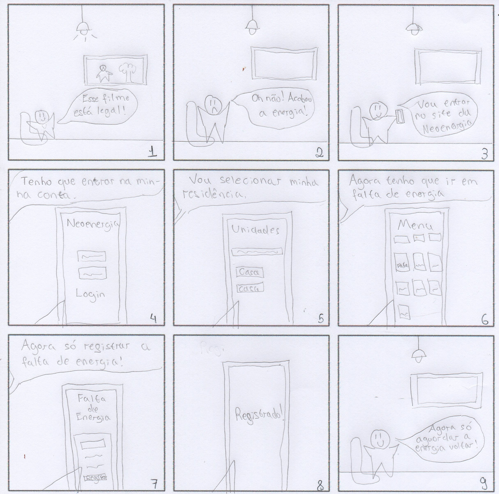

# **Storyboards**

## Introdução

Os storyboards são utilizados como uma ferramenta no design de interação para explorar ideias sobre como melhorar a prática de trabalho dos usuários com o suporte oferecido pela tecnologia. Eles auxiliam o designer a projetar soluções que aprimorem o trabalho dos usuários, permitindo visualizar e planejar a interface e a interação de forma mais clara. Uma vez criados, os storyboards ajudam a consolidar ideias e servem como base para o desenvolvimento de protótipos, possibilitando um processo iterativo de refinamento até alcançar uma solução satisfatória​. Neste documento, iremos realizar um storyboard para cada tarefa analisada, mostrando a imagem do storyboard e especificando as pessoas envolvidas, o ambiente, as tarefas, os passos envolvidos, a motivação e o resultado.

## Tarefa 1 - Registrar Falta de Energia

O storyboard apresentado na figura 1 representa um usuário utilizando o sistema quando teve um problema de falta de energia.

**Figura 1:** Storyboard de falta de energia

{ width="600px"}

_Fonte: Henrique Alencar_

* **Pessoas envolvidas:** Carlos, 42 anos, gerente financeiro. Apenas um usuário comum.
* **Ambiente:** Em sua casa, na sala assistindo TV.
* **Tarefas:** Acessar o site da neoenergia, logar, escolher sua residência, registrar falta de energia.
* **Passos envolvidos:** 1. Acessar o site; 2. Inserir os dados para fazer login; 3. Escolher sua residência; 4. Acessar a função de falta de energia no menu. 5. Registrar o problema de energia.
* **Motivação de usar a aplicação:** Resolver seu problema de energia.
* **O que precisam fazer:** Acessar o site e registrar o problema.
* **O que motivou a usar o sistema:** Facilidade de acessar o site e rapidez ao realizar a tarefa.
* **Resultado ao completar a tarefa:** Carlos se sentiu satisfeito em ter feito o registro e agora aguarda a resolução do seu problema.

## Bibliografia
> BARBOSA, S.D.J.; SILVA, B.S. Interação Humano-Computador. Editora Campus-Elsevier, 2010.

## Histórico de versão

| Versão | Data       | Descrição                                | Autor(es)                                                                                       | Revisor(es)                                                                                                                                    |
| ------ | ---------- | ---------------------------------------- | ----------------------------------------------------------------------------------------------- | ---------------------------------------------------------------------------------------------------------------------------------------------- |
| `1.0`  | 10/12/2024 | Criação da página                     | [Henrique Alencar](https://github.com/henryqma) | Dara Maria, Davi Casseb |